# TP Optimisation - Index et Tables Partitionnées

## INDEX

---

### Question 1 — `SELECT * FROM film WHERE id=5200;`

#### Sans index
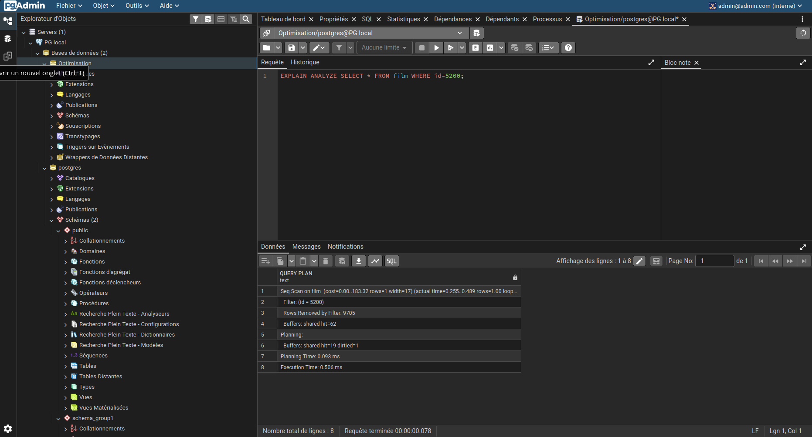

Coût : **183.32**. Sans index, PostgreSQL effectue un **Seq Scan** : il parcourt les 9 706 lignes une par une. 9 705 lignes sont lues inutilement pour retourner 1 seul résultat.

#### Avec `CREATE UNIQUE INDEX idx_film_id ON film(id)`
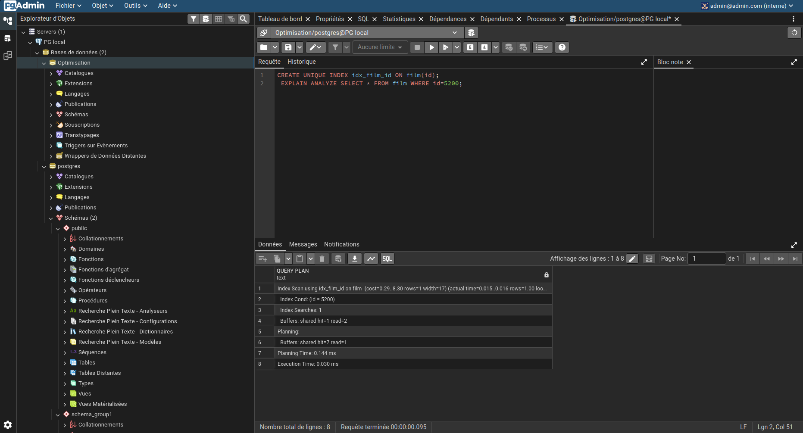

Coût : **8.30** (~22x moins coûteux). PostgreSQL utilise un **Index Scan** : il descend dans l'arbre B-tree pour trouver directement l'id 5200, puis lit la page de données. Seulement 3 pages lues au total (2 niveaux d'index + 1 page de données).

---

### Question 2 — `SELECT * FROM film WHERE id=5200 AND pays='CH/FR';`

#### Sans index
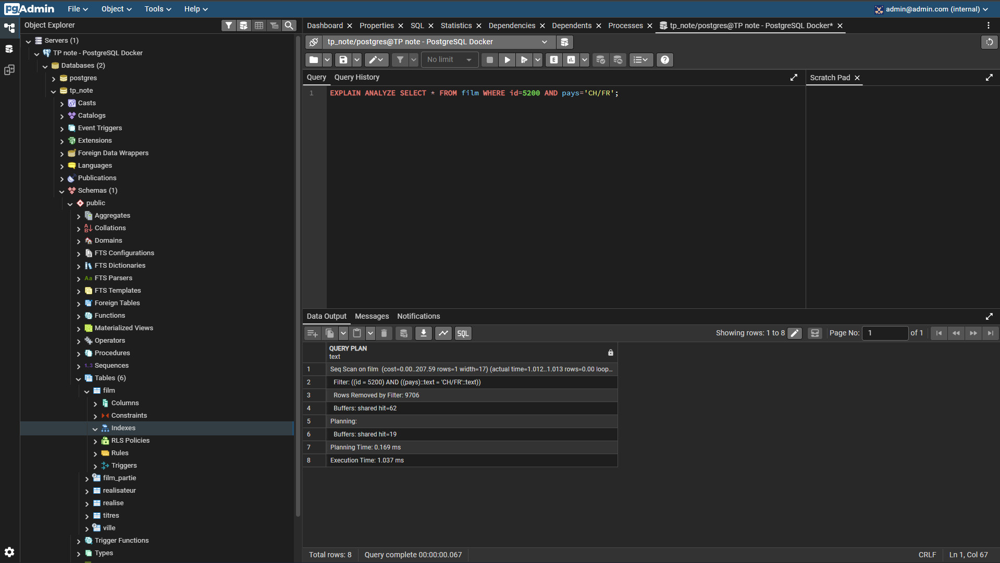

Coût : **207.59**. Seq Scan complet sur les 9 706 lignes.

#### Avec index unique sur ID uniquement
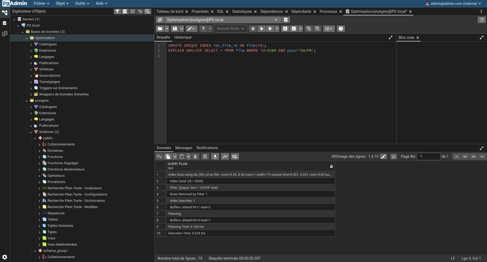

Coût : **8.30**. L'index sur `id` isole directement 1 ligne, puis `pays` est vérifié en mémoire. Avec AND, le critère le plus sélectif suffit.

#### Avec les 2 index (id + pays)
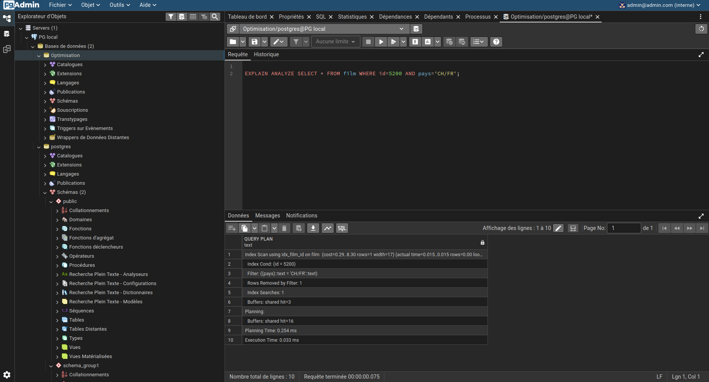

Coût : **8.30** — identique. PostgreSQL **ignore l'index sur pays** : l'index sur `id` (unique) est déjà optimal, ajouter un second index n'apporte rien avec AND.

#### Tailles des index


L'index sur `id` est plus volumineux (232 kB) car dense (1 entrée par ligne). L'index sur `pays` est plus petit (112 kB) car peu de valeurs distinctes. Les 2 index représentent 69% du volume data de la table.

---

### Question 3 — `SELECT * FROM film WHERE id=5200 OR pays='CH/FR';`

#### Sans index
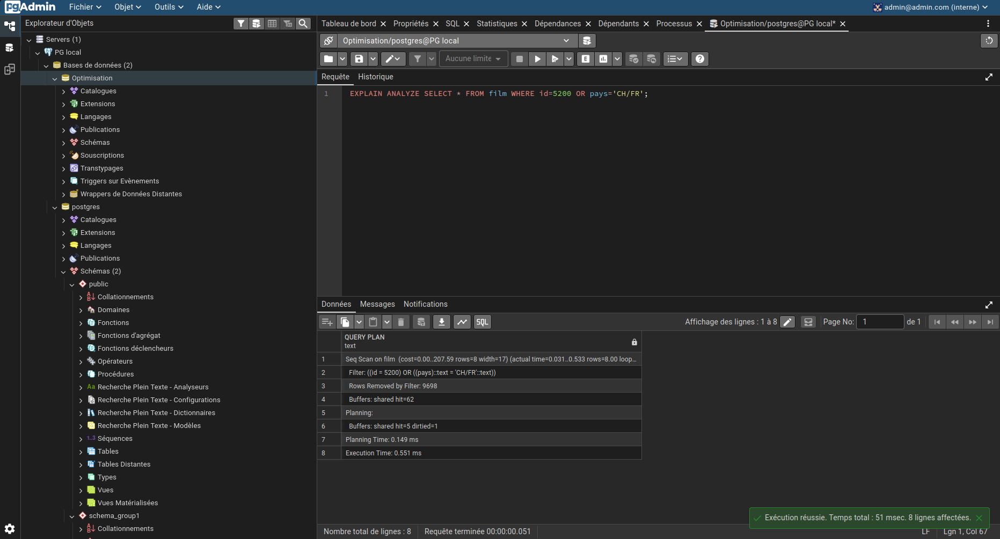

Coût : **207.59**. Seq Scan obligatoire.

#### Avec index sur ID uniquement
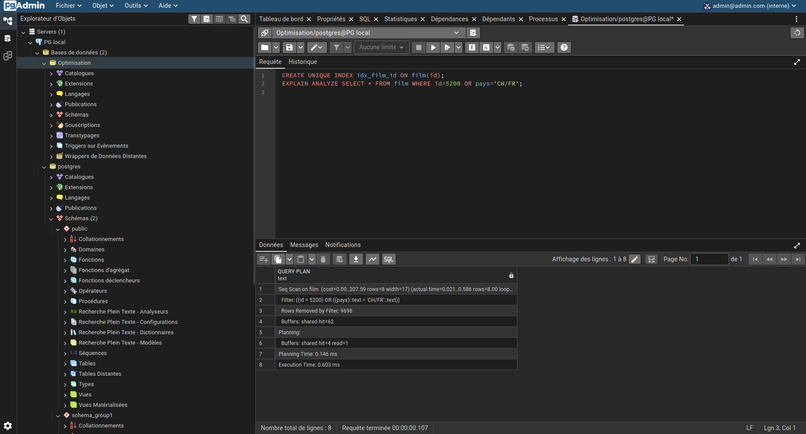

Coût : **207.59** — aucun changement. Avec OR, un seul index ne suffit pas : PostgreSQL devrait quand même parcourir toute la table pour `pays='CH/FR'`, il préfère donc le Seq Scan direct.

#### Avec les 2 index (id + pays)
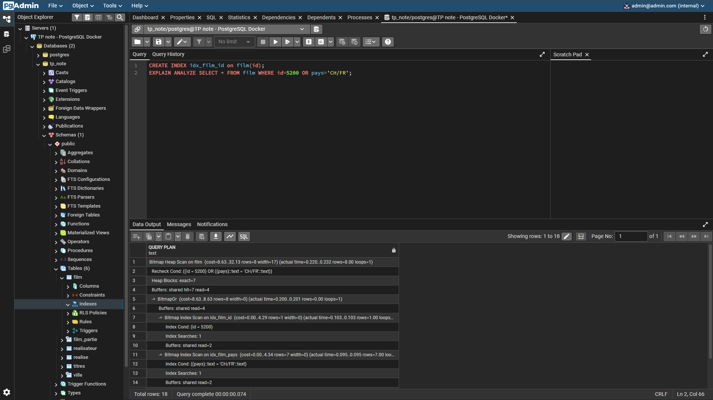

Coût : **32.13**. PostgreSQL utilise un **Bitmap OR** : chaque index produit un bitmap des lignes correspondantes, ils sont fusionnés puis les 8 lignes sont lues directement dans la table.

**Conclusion :** Avec AND (Q2), 1 index suffit (le plus sélectif). Avec OR, il faut **un index sur chaque condition** sinon PostgreSQL revient au Seq Scan.

---

### Question 4 — `SELECT * FROM film WHERE id>2000;`

#### Sans index
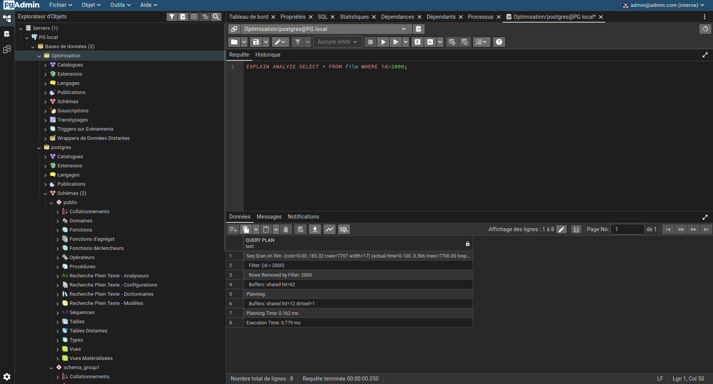

Coût : **183.32**. Seq Scan, 7 706 lignes retournées sur 9 706 (~79% de la table).

#### Avec `CREATE UNIQUE INDEX idx_film_id ON film(id)`
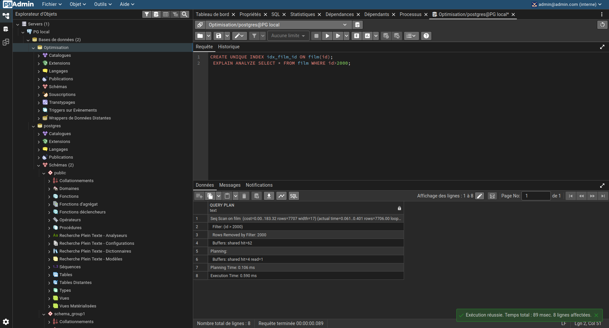

Coût : **183.32** — **aucun changement**. PostgreSQL ignore l'index. Retourner 79% de la table via un index serait plus coûteux qu'un Seq Scan direct sur les 62 pages. L'index n'est utile que si peu de lignes sont retournées (< ~20-30%).

---

### Question 5 — `SELECT * FROM film WHERE id>8000;`

#### Avec `CREATE UNIQUE INDEX idx_film_id ON film(id)`


Coût : **68.14**. Cette fois PostgreSQL **utilise l'Index Scan**. Seulement **1 706 lignes** sur 9 706 sont retournées (~17% de la table), ce qui est en dessous du seuil de rentabilité de l'index (~20-30%).

**Comparaison avec Q4 :** `id>2000` retournait 79% des lignes → Seq Scan. `id>8000` retourne seulement 17% → Index Scan. C'est le **volume de données retourné** qui détermine si l'index est utilisé : plus la sélection est restrictive, plus l'index est rentable.

---

### Question 6 — Index multicolonnes

#### Bloc 1 — `CREATE INDEX idx_film_pays_annee ON film(pays, annee)`


`WHERE pays='CH/FR'` → **Bitmap Heap Scan** via `idx_film_pays_annee`. La 1ère colonne de l'index correspond au critère : l'index est utilisé.

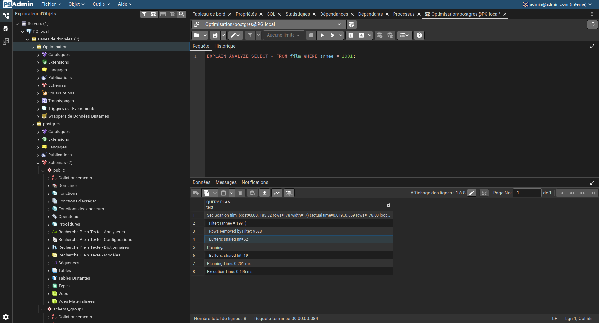

`WHERE annee=1991` → **Seq Scan** (coût 183.32). La 2ème colonne seule ne suffit pas à exploiter l'index multicolonne : PostgreSQL l'ignore.

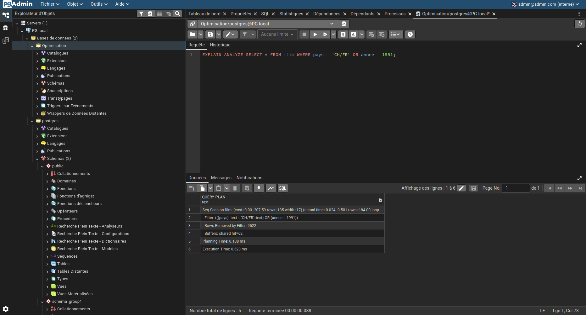

`WHERE pays='CH/FR' OR annee=1991` → **Seq Scan**. Avec OR et un seul index, si une condition ne peut pas utiliser l'index (annee seul), PostgreSQL revient au Seq Scan complet.

#### Bloc 2 — `CREATE INDEX idx_film_annee_pays ON film(annee, pays)`

`WHERE pays='CH/FR'` → **Index Scan** via `idx_film_annee_pays`. Grâce au **Skip Scan** de PostgreSQL 18, même la 2ème colonne peut utiliser l'index (contrairement au Bloc 1).

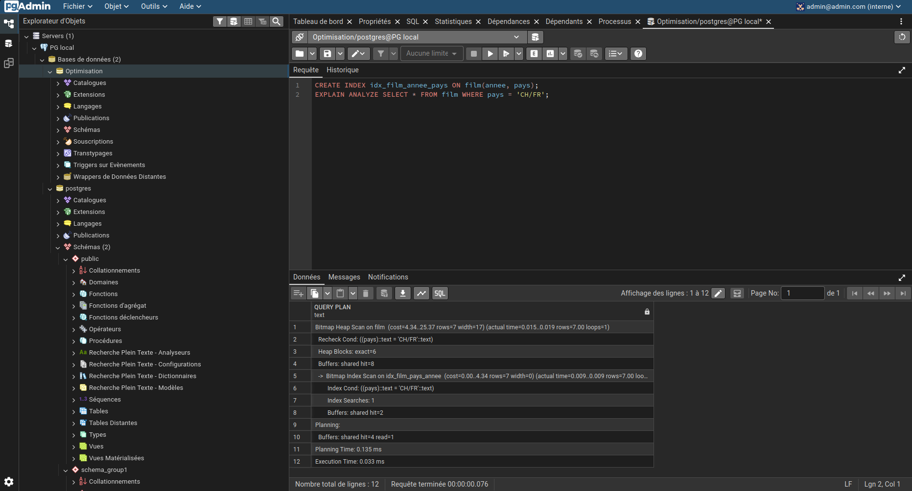

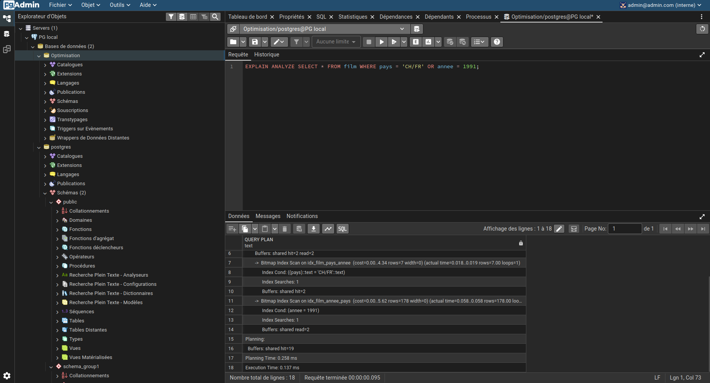

`WHERE annee=1991` → **Bitmap Heap Scan** via `idx_film_annee_pays`. La 1ère colonne correspond au critère : utilisation optimale.

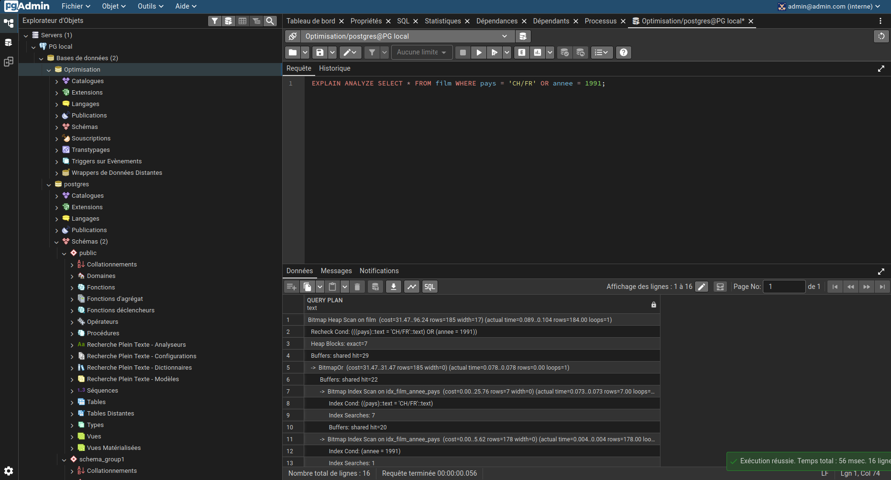

`WHERE pays='CH/FR' OR annee=1991` → **Bitmap OR** via le même index pour les 2 conditions grâce au Skip Scan.

#### Bloc 3 — 2 index mono-colonne : `idx_film_pays` + `idx_film_annee`

`WHERE pays='CH/FR'` → **Bitmap Heap Scan** via `idx_film_pays`.
`WHERE annee=1991` → **Index Scan** via `idx_film_annee`.

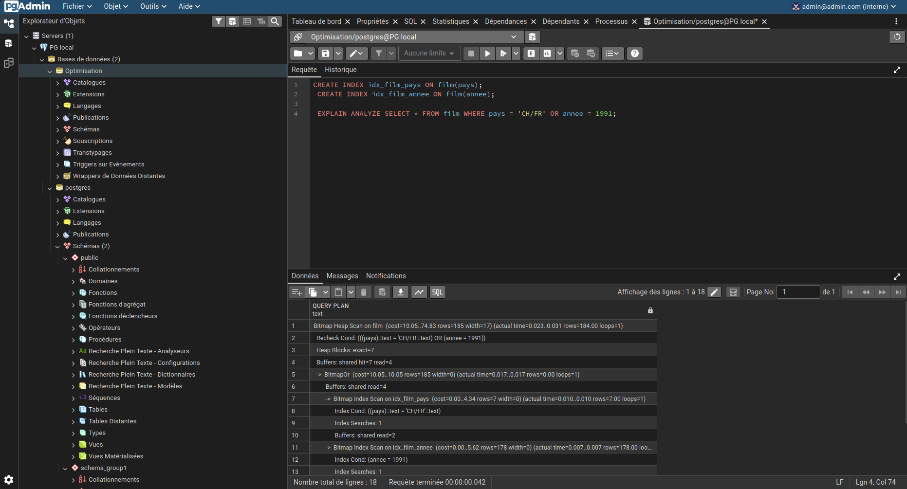

`WHERE pays='CH/FR' OR annee=1991` → **Bitmap OR** avec les 2 index distincts. Résultat identique au Bloc 2 mais avec 2 index séparés.

#### Tailles des index
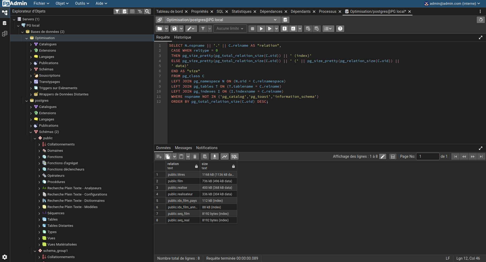

| Index | Taille |
|---|---|
| idx_film_pays (mono) | 112 kB |
| idx_film_annee (mono) | 88 kB |
| **Total 2 mono** | **200 kB** |

Un index multicolonne est plus compact que 2 index mono-colonne séparés car il ne stocke qu'une seule entrée par ligne pour les 2 champs combinés.

#### Synthèse
L'index multicolonne est pertinent uniquement si la **1ère colonne est systématiquement présente dans les requêtes** (règle du préfixe). Sous PostgreSQL 18, le Skip Scan atténue cette contrainte. Les 2 index mono-colonne sont plus flexibles (chaque condition peut utiliser son index indépendamment) mais occupent plus d'espace et pénalisent davantage les écritures.

---
### Question 7 — Index multicolonnes sur table de jointure (Realise)

#### Avec index unique multicolonne sur (id_film, id_real)

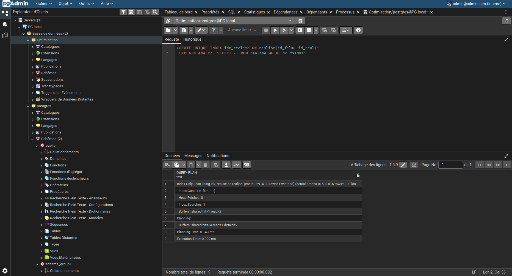

`WHERE id_film=1` → **Index Only Scan** via `idx_realise` (coût 4.30). La 1ère colonne correspond : index utilisé et même pas besoin d'accéder à la table (toutes les colonnes sont dans l'index).

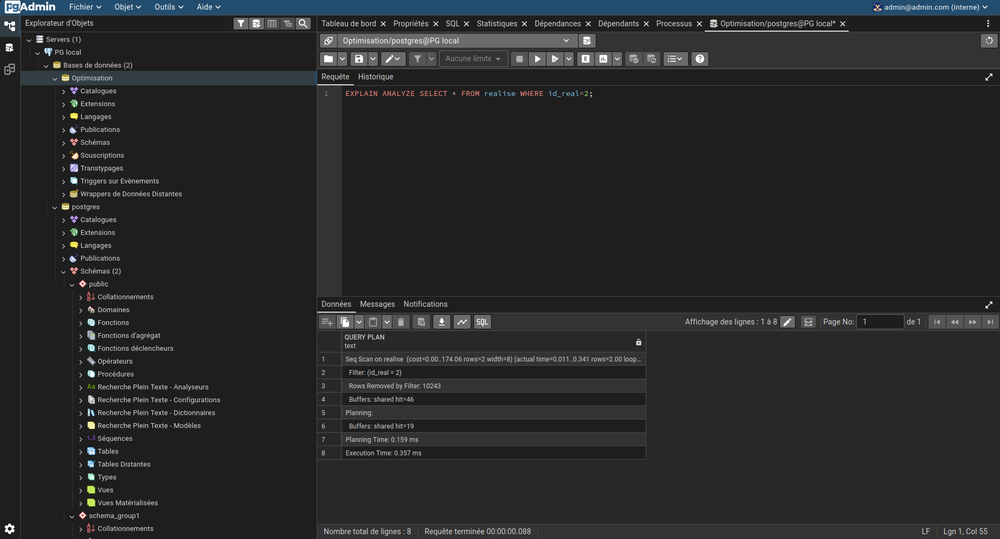

`WHERE id_real=2` → **Seq Scan** (coût 174.06). La 2ème colonne seule ne suffit pas : index ignoré, 10 243 lignes parcourues inutilement.

#### Avec index unique multicolonne + 2 index mono-colonne (id_film et id_real)

`WHERE id_film=1` → **Index Only Scan** via `idx_realise` (coût 4.30). Identique.

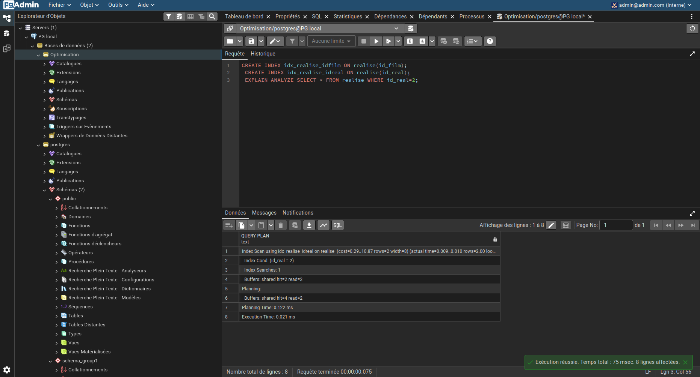

`WHERE id_real=2` → **Index Scan** via `idx_realise_idreal` (coût 10.87). Cette fois l'index mono-colonne sur `id_real` est utilisé.

#### Préconisation
Pour une table de jointure (association), il faut **combiner les deux approches** :
- Un **index unique multicolonne** sur (id_film, id_real) pour garantir l'unicité (équivalent PK) et couvrir les recherches sur la 1ère colonne.
- Un **index mono-colonne sur la 2ème FK** (id_real) pour couvrir les recherches sur cette colonne seule.

Règle générale : **toujours indexer les clés étrangères** (FK) car elles sont très fréquemment utilisées dans les jointures et les recherches.

---

### Question 8 — `SELECT * FROM film WHERE SUBSTR(pays,1,2) = 'CH';`

**Avec `idx_film_pays` (index sur pays) :** Seq Scan, coût **207.59**. L'index sur `pays` est ignoré car la requête n'utilise pas `pays` directement mais une **fonction** appliquée dessus (`SUBSTR`). PostgreSQL ne peut pas utiliser un index B-tree sur `pays` pour rechercher sur `SUBSTR(pays,1,2)`.

**Avec `idx_film_substr_pays` (index sur expression) :** Bitmap Heap Scan, coût **67.10**. En indexant directement l'expression `substr(pays,1,2)`, PostgreSQL peut utiliser l'index car la valeur calculée est stockée dans l'index. L'index sur fonction résout exactement ce problème.

**Conclusion :** Un index classique sur une colonne est inefficace si une fonction est appliquée dans le WHERE. Il faut créer un **index sur expression** qui pré-calcule et stocke le résultat de la fonction.

---

### Question 9 — JOIN Film / Titres sans restriction

**Sans index :** Hash Join, coût **903.25**. PostgreSQL charge film en table de hachage (Hash) puis parcourt titres séquentiellement pour matcher. Les 2 tables sont entièrement lues via Seq Scan car toutes les lignes sont retournées (20 247 résultats).

**Avec idx_film_id (PK film) :** Hash Join, coût **678.03**. Le plan ne change pas (toujours Hash Join + Seq Scans) car **toutes les lignes sont retournées**. L'index sur la PK n'est d'aucune utilité ici : PostgreSQL doit de toute façon lire film entièrement pour construire la table de hachage.

**Avec idx_film_id + idx_titres_id_film :** Hash Join, coût **678.03** — identique. Même raisonnement : la jointure retourne 20 247 lignes, soit la totalité de titres. Les index ne servent à rien quand il n'y a pas de restriction réduisant le volume.

**Conclusion :** Sans clause WHERE restrictive, une jointure complète utilise toujours le **Hash Join** et les **Seq Scans**, quel que soit l'indexation. Les index ne sont utiles que si une restriction filtre suffisamment les données.

---

### Question 10 — JOIN Film / Titres avec `WHERE f.pays='FR/BE'`

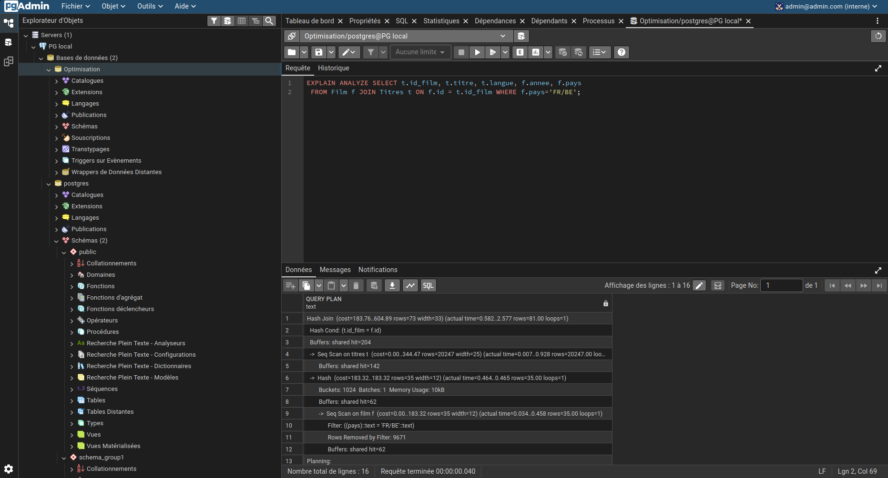

**Sans index :** Hash Join, coût **604.89**. Titres est parcourue entièrement (Seq Scan, 20 247 lignes), film aussi (Seq Scan avec filtre pays, 35 résultats). La restriction réduit le volume mais sans index PostgreSQL doit tout lire.

**Avec idx_film_id (PK film) :** Hash Join, coût **581.40** — quasiment identique. L'index sur id ne sert pas ici car la restriction porte sur `pays`, pas sur `id`.

**Avec idx_film_id + idx_film_pays :** Hash Join, coût **458.62**. L'index sur `pays` est utilisé : Bitmap Heap Scan sur film (35 lignes récupérées directement). Titres est toujours en Seq Scan car aucun index n'y est posé.

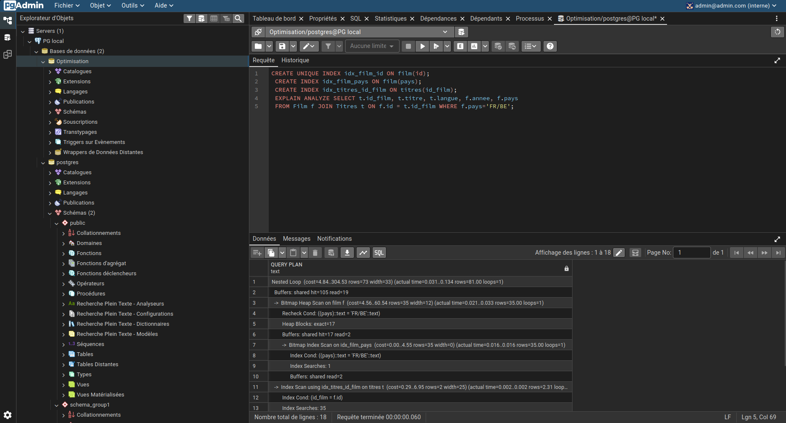

**Avec idx_film_id + idx_film_pays + idx_titres_id_film :** **Nested Loop**, coût **304.53**. Changement majeur : PostgreSQL bascule vers une boucle imbriquée. Film est filtré via `idx_film_pays` (35 lignes), puis pour chacune, `idx_titres_id_film` (FK) localise directement les titres correspondants. C'est le plan optimal.

**Index utilisés et principe :**
- `idx_film_pays` → index sur la **condition de recherche** (WHERE)
- `idx_film_id` → index sur la **PK** (clé de jointure côté film)
- `idx_titres_id_film` → index sur la **FK** (clé de jointure côté titres)

**Principe :** Pour optimiser une jointure avec restriction, il faut indexer : (1) les champs du WHERE, (2) les PK, (3) les FK. C'est la même conclusion qu'en Q7.

---

### Question 11 — Index partiel

```sql
CREATE INDEX idx_film_annee ON film(annee) WHERE annee >= 2000;
```

**`WHERE annee = 2003` :** Index Scan, coût **29.51**. 2003 >= 2000 → l'index partiel couvre cette valeur, il est utilisé.

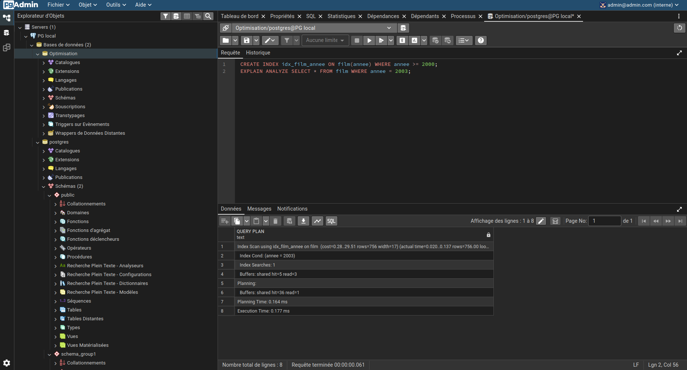

**`WHERE annee = 1995` :** Seq Scan, coût **183.32**. 1995 < 2000 → hors de la plage de l'index partiel, PostgreSQL l'ignore et parcourt toute la table. Pourtant il y a moins de films en 1995 (639) qu'en 2003 (756) — l'index n'est pas disponible pour les années < 2000.

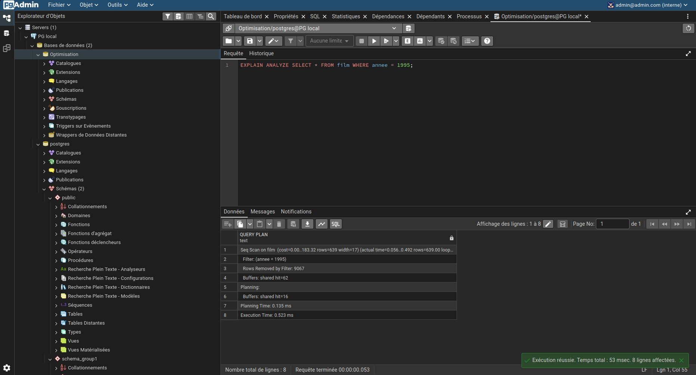

**Conclusion :** Un index partiel couvre uniquement le sous-ensemble de données défini par sa condition. Il est plus compact et plus rapide qu'un index complet, mais uniquement pour les requêtes portant sur la plage couverte. Ici, il est pertinent si les films récents (>= 2000) sont beaucoup plus souvent requêtés que les anciens.

---

### Question 12 — Vue `films1995`

```sql
CREATE OR REPLACE VIEW films1995 AS SELECT id, annee FROM film WHERE annee = 1995;
SELECT * FROM films1995;
```

**Plan :** Seq Scan sur `film`, coût **183.32**, filtre `annee = 1995`.

**Constat :** La vue est **transparente** — PostgreSQL exécute directement le SELECT interne à la vue sur la table réelle. Aucune donnée n'est stockée. Le coût est identique à `SELECT * FROM film WHERE annee = 1995` sans vue.

**Préconisation :** Sans index sur `annee`, la vue génère un Seq Scan à chaque appel. Pour optimiser, il faudrait créer un index sur `film(annee)` (ou un index partiel comme en Q11). Si la vue est très fréquemment appelée et que les données changent peu, une **vue matérialisée** (`MATERIALIZED VIEW`) serait encore plus performante car elle stocke physiquement les résultats.

---

### Question 13 — 3 façons d'obtenir le MAX(id) — sans index

**Requête 1 — `WHERE id >= ALL(...)`**
Coût : **1 125 375** — Exécution : ~2 735 ms. La sous-requête est exécutée **9 706 fois** (1 fois par ligne de film). Plan catastrophique : Nested Loop avec Seq Scan répété sur toute la table.

**Requête 2 — `NOT EXISTS`**
Coût : **942 552** — Exécution : ~2 531 ms. Nested Loop Anti Join : pour chaque ligne de f1, PostgreSQL cherche une ligne f2 avec id supérieur. Légèrement moins catastrophique que ALL mais reste une double boucle complète (47 millions de comparaisons).

**Requête 3 — `SELECT MAX(id)`**
Coût : **183.33** — Exécution : ~0.68 ms. Un seul Seq Scan + agrégat. PostgreSQL lit la table une seule fois et garde le maximum en mémoire. **Incomparablement plus rapide.**

**Classement par efficacité :** MAX > NOT EXISTS > ALL

**Conclusion :** `MAX()` est la seule écriture adaptée pour ce type de requête. Les formes ALL et NOT EXISTS génèrent des plans en O(n²) catastrophiques.

---

### Question 14 — Réalisateurs n'ayant jamais réalisé de film

#### a. Plans d'exécution (sans index)

**NOT IN** — coût **286.76**, ~2.9 ms
Seq Scan sur realisateur avec sous-plan haché (hashed SubPlan) : PostgreSQL charge tous les id_real de Realise en table de hachage, puis filtre realisateur. Moins coûteux que la Q13 mais reste sous-optimal.

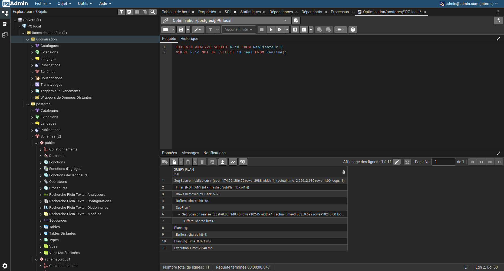

**NOT EXISTS** — coût **461.78**, ~1.75 ms
PostgreSQL transforme le NOT EXISTS en **Hash Right Anti Join** : il charge realisateur en table de hachage, parcourt realise et retourne les réalisateurs sans correspondance. Plan identique au LEFT JOIN.

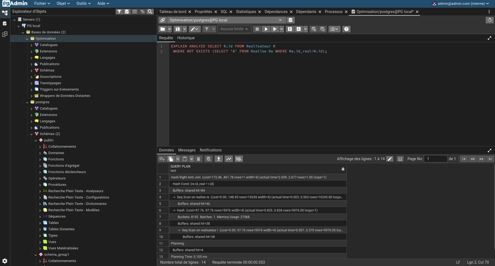

**LEFT JOIN ... IS NULL** — coût **461.78**, ~1.71 ms
Plan strictement identique au NOT EXISTS : PostgreSQL génère le même **Hash Right Anti Join**. L'optimiseur reconnaît que les deux écritures sont équivalentes.

**Classement :** NOT IN (286.76) < NOT EXISTS ≈ LEFT JOIN (461.78) en coût estimé, mais NOT EXISTS et LEFT JOIN sont plus rapides en pratique (~1.7 ms vs ~2.9 ms).

#### b. Comparaison Oracle
Sous Oracle 11g, les 3 requêtes ont le même coût et le même plan (l'optimiseur les unifie). Sous Oracle 10g, EXISTS et OUTER JOIN sont bien plus performants que NOT IN. Cela montre qu'**un changement de version ou de SGBD peut totalement modifier les plans d'exécution** : une requête optimale sur un SGBD peut devenir catastrophique sur un autre. Il ne faut pas supposer que le comportement sera identique lors d'une migration.

#### c. Optimisation par index
Oui, 2 index sont utiles :
- `CREATE INDEX idx_realise_idreal ON realise(id_real);` — FK côté Realise (champ de jointure)
- `CREATE UNIQUE INDEX idx_realisateur_id ON realisateur(id);` — PK de Realisateur

Ces index permettraient de passer d'un Hash Join à un Nested Loop si peu de réalisateurs sont concernés.

---

### Question 15 — 4 écritures équivalentes (sans index)

| Requête | Plan | Coût |
|---|---|---|
| `BETWEEN 2000 AND 2001` | Seq Scan | 207.59 |
| `id=2000 OR id=2001` | Seq Scan | 207.59 |
| `id IN (2000, 2001)` | Seq Scan | **183.32** |
| `UNION` | 2x Seq Scan + Sort + Unique | 366.69 |

**IN est le plus performant** (coût 183.32 vs 207.59). PostgreSQL optimise `IN` avec un filtre `ANY` sur tableau, légèrement plus efficace que BETWEEN ou OR.

**UNION est de loin le plus coûteux** (366.69) : il exécute 2 Seq Scans séparés sur toute la table, puis trie et dédoublonne les résultats — un surcoût inutile ici.

**Conclusion :** Préférer `IN` à `OR` ou `BETWEEN` pour des listes de valeurs discrètes. Éviter `UNION` quand `OR` ou `IN` suffisent. Sous Oracle, BETWEEN/OR/IN ont le même coût — comportement différent selon le SGBD.

---

### Question 16 — Division relationnelle : réalisateurs ayant réalisé tous les films

**NOT EXISTS imbriqué** — coût **5 792 436 113** (~5 milliards), ~108 ms
Plan catastrophique en théorie (coût estimé énorme dû aux boucles imbriquées x9706 x5976). En pratique ~108 ms car PostgreSQL optimise avec un SubPlan haché et bénéficie de l'**arrêt anticipé (Early Exit)** : dès qu'un film manque pour un réalisateur, la recherche s'arrête pour ce tuple.

**COUNT avec GROUP BY HAVING** — coût **1 504.72**, ~5.6 ms
Plan bien plus efficace : Hash Join entre realisateur et realise, tri, GroupAggregate + filtre sur COUNT. Bien plus rapide en pratique (~20x).

**Classement : COUNT >> NOT EXISTS** (1 504 vs 5 792 436 113 en coût estimé, 5.6 ms vs 108 ms).

**Nuance :** Sur de très gros volumes ou avec des requêtes plus complexes, NOT EXISTS peut redevenir compétitif grâce à l'Early Exit. De plus, NOT EXISTS fonctionne toujours (même avec doublons ou NULL), contrairement au COUNT qui peut être incorrect dans certains cas.

---

## TABLES PARTITIONNÉES

### 1-2. Création de la table et des partitions

```sql
CREATE TABLE ville (...) PARTITION BY LIST (upper(pays));
-- Partitions niveau 1
CREATE TABLE villeFR PARTITION OF ville FOR VALUES IN ('FRANCE');
CREATE TABLE villeDE PARTITION OF ville FOR VALUES IN ('ALLEMAGNE');
CREATE TABLE villeUS PARTITION OF ville FOR VALUES IN ('USA');
-- Partition niveau 2 (ITALY sous-partitionnée par RANGE)
CREATE TABLE villeIT PARTITION OF ville FOR VALUES IN ('ITALY') PARTITION BY RANGE (nbhabitants);
CREATE TABLE villeIT_1_to_1M  PARTITION OF villeIT FOR VALUES FROM (1) TO (1000000);
CREATE TABLE villeIT_1M1_to_10M PARTITION OF villeIT FOR VALUES FROM (1000001) TO (10000000);
```

### 3. Plans d'exécution

**`WHERE nom = 'Lyon'`** — Append sur **5 partitions**, coût 68.15

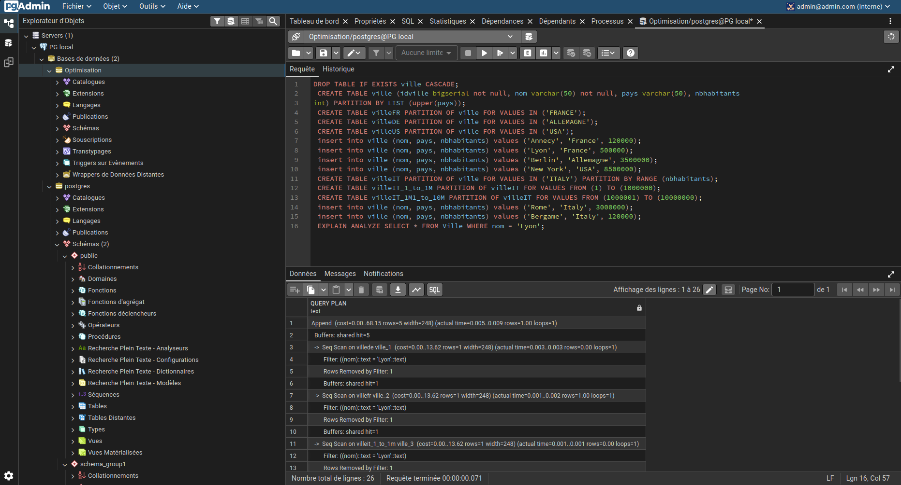

```
Append
  -> Seq Scan on villede   (0 ligne)
  -> Seq Scan on villefr   (1 ligne  ← Lyon trouvé ici)
  -> Seq Scan on villeit_1_to_1m
  -> Seq Scan on villeit_1m1_to_10m
  -> Seq Scan on villeus
```
La clé de partition est `pays`, pas `nom` → PostgreSQL ne peut pas éliminer de partitions. Il parcourt les **5 partitions** même si Lyon n'est que dans villeFR.

**`WHERE nbhabitants=120000`** — Append sur **4 partitions**, coût 54.52

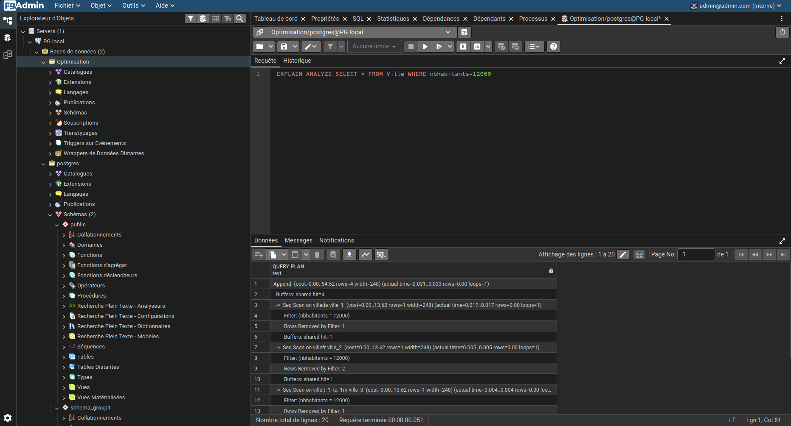

```
Append
  -> Seq Scan on villede
  -> Seq Scan on villefr
  -> Seq Scan on villeit_1_to_1m   (120000 est dans la plage 1→1M)
  -> Seq Scan on villeus
```
PostgreSQL **élimine villeIT_1M1_to_10M** grâce au partitionnement RANGE : 120 000 ne peut pas être dans la plage 1 000 001→10 000 000. C'est le **partition pruning** en action.

**Remarque :** Avec seulement 6 lignes, le partitionnement est plus coûteux que sans partition (multiple Seq Scans). Sur une très grande table, le rapport s'inverse : le pruning évite de scanner des millions de lignes inutilement.

### 4. Suppression
```sql
DROP TABLE ville CASCADE;
```

---

## SYNTHÈSE GLOBALE

### Synthèse — Indexation

**Sur quels champs créer des index ?**
- Les **clés primaires (PK)** : index unique, garantit l'unicité et optimise les jointures et recherches par identifiant.
- Les **clés étrangères (FK)** : index non unique, indispensable pour les jointures (Q7, Q10). Sans index sur la FK, PostgreSQL utilise un Hash Join au lieu d'un Nested Loop bien plus efficace.
- Les **champs du WHERE fréquemment utilisés** : améliore les sélections (Q2, Q8, Q10).
- Les **expressions/fonctions** : si une fonction est appliquée dans le WHERE, créer un index sur cette expression (Q8).

**Conditions pour qu'un index soit utilisé :**
- La requête doit retourner **moins de ~20-30% des lignes** (Q4 vs Q5). Au-delà, le Seq Scan est préféré.
- Pour une clause **AND**, un seul index sur le champ le plus sélectif suffit (Q2).
- Pour une clause **OR**, il faut **un index sur chaque condition** sinon PostgreSQL revient au Seq Scan (Q3).
- Pas d'index sur une **fonction** appliquée à la colonne sans index d'expression (Q8).

**Index mono-colonne vs multicolonne :**
- Un index multicolonne n'est utile que si la **1ère colonne est présente dans le WHERE** (règle du préfixe, Q6). PostgreSQL 18 atténue cela avec le Skip Scan.
- Pour une table de jointure, combiner un index unique multicolonne (PK composite) + un index mono-colonne sur la 2ème FK (Q7).
- 2 index mono-colonne sont plus flexibles mais plus volumineux qu'un index multicolonne.

**Règle générale :** ~40% du volume de la base doit être indexé. Un excès d'index pénalise les écritures (INSERT/UPDATE), un manque pénalise les lectures (SELECT).

---

### Synthèse — Optimisation de requêtes

**Forme des requêtes :**
- Préférer `IN` à `OR` ou `BETWEEN` pour des valeurs discrètes (Q15).
- Éviter `UNION` quand `OR` ou `IN` suffisent — `UNION` génère 2 Seq Scans + tri (Q15).
- Préférer `MAX()`/`MIN()` à `ALL` ou `NOT EXISTS` pour trouver une valeur extrême — gain de plusieurs ordres de grandeur (Q13).
- Pour une division relationnelle, préférer `COUNT + GROUP BY HAVING` à `NOT EXISTS` imbriqué sur petits volumes (Q16), mais NOT EXISTS reste plus sûr avec des NULL ou doublons.
- `NOT EXISTS` et `LEFT JOIN ... IS NULL` génèrent le même plan sous PostgreSQL (Q14).

**Impact du changement de SGBD ou de version :**
- Les plans d'exécution peuvent changer radicalement d'une version à l'autre ou d'un SGBD à l'autre (Q14, Q15). Une requête optimale sous Oracle 10g peut être sous-optimale sous Oracle 11g et vice-versa.
- Ne jamais supposer que le comportement sera identique lors d'une migration — toujours re-tester les plans critiques.

**Jointures :**
- Sans restriction (toutes les lignes retournées) → Hash Join inévitable, les index n'aident pas (Q9).
- Avec restriction → indexer le champ du WHERE + les FK pour permettre un Nested Loop (Q10).

---

## RÉSULTATS ATTENDUS — GUIDE DE REVIEW

| Q | Étape | Type de scan attendu | Coût attendu |
|---|---|---|---|
| 1 | Sans index | Seq Scan | 183.32 |
| 1 | Avec idx_film_id | Index Scan | 8.30 |
| 2 | Sans index | Seq Scan | 207.59 |
| 2 | Avec idx_film_id | Index Scan | 8.30 |
| 2 | Avec idx_film_id + idx_film_pays | Index Scan (idx_film_id, pays ignoré) | 8.30 |
| 3 | Sans index | Seq Scan | 207.59 |
| 3 | Avec idx_film_id seul | Seq Scan (index ignoré) | 207.59 |
| 3 | Avec idx_film_id + idx_film_pays | Bitmap Heap Scan + BitmapOr | 32.13 |
| 4 | Sans index | Seq Scan | 183.32 |
| 4 | Avec idx_film_id | Seq Scan (index ignoré, 79% lignes) | 183.32 |
| 5 | Avec idx_film_id | Index Scan | 68.14 |
| 6 | (pays,annee) — WHERE pays | Bitmap Heap Scan | ~25 |
| 6 | (pays,annee) — WHERE annee | Seq Scan (index ignoré) | 183.32 |
| 6 | (pays,annee) — OR | Seq Scan | 207.59 |
| 6 | (annee,pays) — WHERE pays | Index Scan (Skip Scan PG18) | ~40 |
| 6 | (annee,pays) — WHERE annee | Bitmap Heap Scan | ~70 |
| 6 | (annee,pays) — OR | Bitmap Heap Scan + BitmapOr | ~96 |
| 6 | 2 mono — OR | Bitmap Heap Scan + BitmapOr | ~75 |
| 7 | idx multicolonne — WHERE id_film | Index Only Scan | 4.30 |
| 7 | idx multicolonne — WHERE id_real | Seq Scan (index ignoré) | 174.06 |
| 7 | + idx mono id_real — WHERE id_real | Index Scan | 10.87 |
| 8 | Index sur pays | Seq Scan (fonction ignorée) | 207.59 |
| 8 | Index sur substr(pays,1,2) | Bitmap Heap Scan | 67.10 |
| 9 | Sans index | Hash Join | 903.25 |
| 9 | Avec idx_film_id | Hash Join (identique) | 678.03 |
| 9 | Avec idx_film_id + idx_titres_id_film | Hash Join (identique) | 678.03 |
| 10 | Sans index | Hash Join | 604.89 |
| 10 | + idx_film_id | Hash Join (quasi identique) | 581.40 |
| 10 | + idx_film_pays | Hash Join (Bitmap sur film) | 458.62 |
| 10 | + idx_titres_id_film | Nested Loop | 304.53 |
| 11 | annee=2003 (index partiel >= 2000) | Index Scan | 29.51 |
| 11 | annee=1995 (hors plage index) | Seq Scan | 183.32 |
| 12 | SELECT * FROM films1995 | Seq Scan (vue transparente) | 183.32 |
| 13 | WHERE id >= ALL(...) | Seq Scan + SubPlan x9706 | 1 125 375 |
| 13 | NOT EXISTS | Nested Loop Anti Join | 942 552 |
| 13 | SELECT MAX(id) | Aggregate + Seq Scan | 183.33 |
| 14 | NOT IN | Seq Scan + hashed SubPlan | 286.76 |
| 14 | NOT EXISTS | Hash Right Anti Join | 461.78 |
| 14 | LEFT JOIN IS NULL | Hash Right Anti Join (identique) | 461.78 |
| 15 | BETWEEN | Seq Scan | 207.59 |
| 15 | OR | Seq Scan | 207.59 |
| 15 | IN | Seq Scan (ANY) | 183.32 |
| 15 | UNION | 2x Seq Scan + Sort + Unique | 366.69 |
| 16 | NOT EXISTS imbriqué | Nested Loop Anti Join | ~5 792 436 113 |
| 16 | COUNT GROUP BY HAVING | GroupAggregate + Hash Join | 1 504.72 |
| TP | WHERE nom='Lyon' (5 partitions) | Append + 5x Seq Scan | 68.15 |
| TP | WHERE nbhabitants=120000 (pruning) | Append + 4x Seq Scan | 54.52 |
